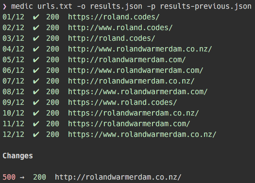

Medic
=====

[](https://travis-ci.org/Rowno/medic)
[](https://david-dm.org/Rowno/medic)
[](https://gratipay.com/Rowno/)

Perform bulk URL status checks and track changes.




Getting Started
---------------

Install the Medic command line tool:
```bash
npm install -g medic
```

Create a `urls.txt` file:
```
# Home pages

https://rolandwarmerdam.co.nz/
https://www.google.com/
https://twitter.com/
http://example.com/
```

Run medic:
```bash
medic urls.txt
```

Also supports piping:
```bash
cat urls.txt | medic
```


Usage
-----

### CLI

```
Usage: medic <path> [<options>]

Path:
    Path to a file containing a list of URLs. Each URL must be on a separate
    line and lines not starting with http:// or https:// are ignored.
    This parameter is ignored when URLs are being piped.

Options:
    -c  --concurrency Number of concurrent requests per origin. Defaults to 5.
    -h, --help        Show this help text.
    -o, --output      File path to output the results of this run to.
    -p, --compare     Path to a previous results file to compare against.
    -v, --version     Print medic's version.
```


### API

#### `.check(object options, [function callback])` -> `Promise`
Checks the status of all the passed URLs.

##### Options

###### `urls`
Type: `array`

###### `onProgress`
Type: `function<object result>`

Gets called on each checked URL and is passed the result.

Example result:
```json
[
  {
    "url": "https://www.google.com/mail/",
    "statusCode": 200,
    "redirectUrl": "https://mail.google.com/mail/"
  }, {
    "url": "http://non-existent.example.com/",
    "error": "getaddrinfo ENOTFOUND"
  }
]
```


#### `.compare(object options)` -> `array`
Compares 2 result sets to find any changes.

Example return:
```json
[
  {
    "current": {
      "url": "https://reader.google.com/",
      "statusCode": 404
    },
    "previous": {
      "url": "https://reader.google.com/",
      "statusCode": 200
    }
  }
]
```

##### Options

###### `currentResults`
Type: `array`

###### `previousResults`
Type: `array`


Related
-------

 - [sitemap-urls][] - Extract URLs from an XML sitemap.


License
-------
Medic is released under the MIT license.

Copyright © 2015 Roland Warmerdam.


[sitemap-urls]: https://github.com/Rowno/sitemap-urls
